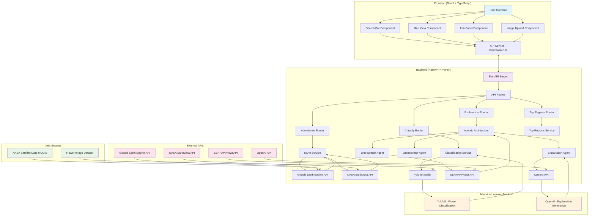

# BloomWatch Project Structure and Workflow

## System Architecture Flowchart

## Detailed Workflow Process

### 1. User Interaction Flow
1. User accesses the BloomWatch web application
2. User can either:
   - Search for a specific region and flower species
   - Upload an image of a flower for classification
3. Frontend sends API requests to backend based on user action

### 2. Backend Processing Flows

#### Flow A: Region/Flower Search
1. Frontend calls `/api/explain` endpoint with region and flower
2. Backend orchestrates multiple agents:
   - **Explanation Agent**: Generates ecological explanations using OpenAI
   - **Web Search Agent**: Fetches real-time information from SERPAPI/NewsAPI
   - **Orchestrator**: Coordinates both agents and synthesizes responses
3. **NDVI Service** retrieves satellite data from NASA EarthData API
4. Backend returns bloom explanation with abundance data to frontend

#### Flow B: Image Classification
1. User uploads flower image via frontend
2. Frontend calls `/api/classify` endpoint
3. Backend uses **Classification Service** with YoloV8 model to identify flower species
4. Returns identified species back to frontend
5. Frontend can then initiate search for abundance data for identified species

#### Flow C: Top Regions Discovery
1. Frontend calls `/api/top-regions` to find optimal viewing locations
2. Backend processes request and returns top regions for specific flower species
3. Results displayed on map in frontend

### 3. Technical Components

#### Frontend Components
- **React Application**: Main UI built with TypeScript
- **Shadcn/UI**: Component library with Tailwind CSS
- **MapLibre GL**: Interactive map visualization
- **React Query**: Server state management
- **API Service**: Communication with backend

#### Backend Components
- **FastAPI**: Web framework with Pydantic models
- **CrewAI**: Agentic architecture for AI tasks
- **LangChain**: LLM integration and orchestration
- **Ultralytics**: YoloV8 model for flower classification
- **GDAL/rasterio**: Geospatial data processing

### 4. Data Flow
- User provides input (region + flower, or image file)
- Frontend sends request to backend APIs
- Backend processes with appropriate services
- External API calls (NASA, OpenAI, etc.) are made as needed
- Results are returned to frontend for display
- Map visualization is updated with relevant data

This architecture provides a comprehensive platform for exploring global flower bloom patterns using satellite data and AI-driven explanations.